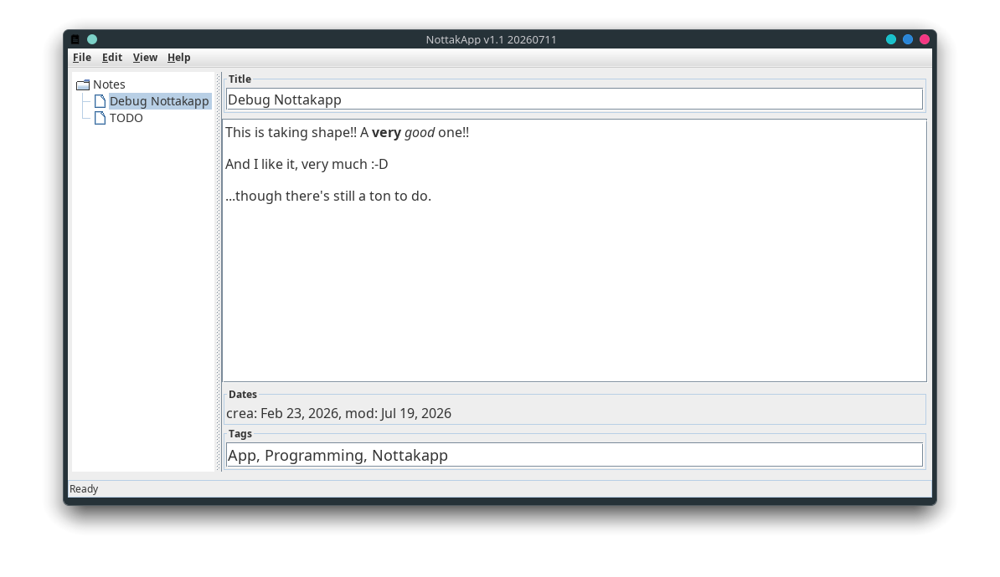

# Notakkapp

## Install Java

You need to install [**Java**](https://www.java.com/) in order to execute this app.

## Execution

Download the `.jar` file, and then execute it with `java -jar`, or just double-click it.

    $ java -jar NottakApp-1.1.jar 

## Remarks

**Nottakapp** is designed to handle its notes in a shared folder (_Dropbox_, _Drive_...), so changes can be carried out in any computer with access to that folder.
